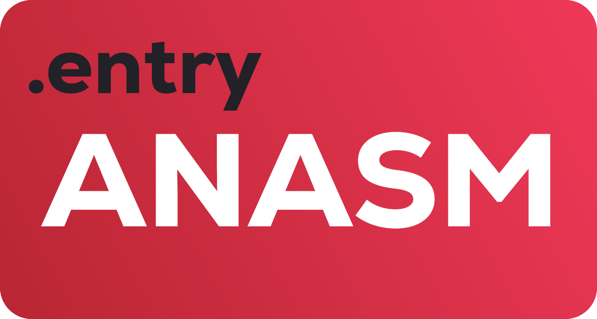

<p align="center">
	
</p>
<p align="center">An assembler for avm</p>
	
<p align="center">
	<a href="./LICENSE">
		
	</a>
	<a href="https://github.com/avm-collection/avm/issues">
		
	</a>
	<a href="https://github.com/avm-collection/avm/pulls">
		
	</a>
</p>

An assembler for the [avm virtual machine](https://github.com/avm-collection/avm) written in Go

## Table of contents
* [Quickstart](#quickstart)
* [Milestones](#milestones)
* [Documentation](#documentation)
* [Bugs](#bugs)
* [Make](#make)

## Quickstart
```sh
$ make
$ make install
$ anasm ./examples/fib.anasm
$ ./fib
```
`anasm ./examples/fib.anasm` compiles the fibonacci sequence example into an avm binary `./fib`

See [the `./examples` folder](./examples) for example programs

## Milestones
- [X] Lexer
- [X] Compiling basic instructions
- [X] Labels
- [X] Instruction argument safety
- [ ] Macros

## Documentation
Coming soon.

## Bugs
If you find any bugs, please create an issue and report them.

## Make
Run `make all` to see all the make rules.
